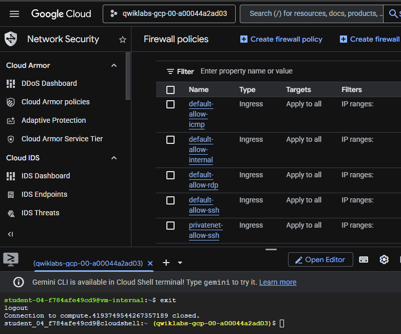
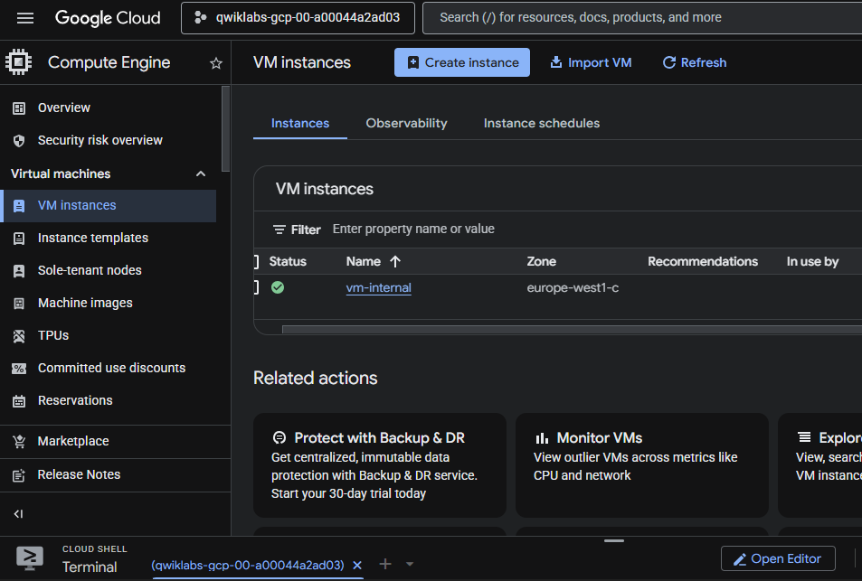
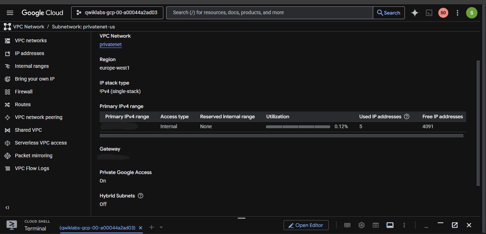
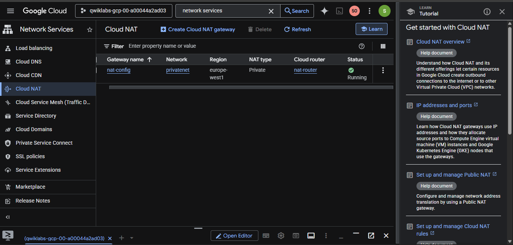
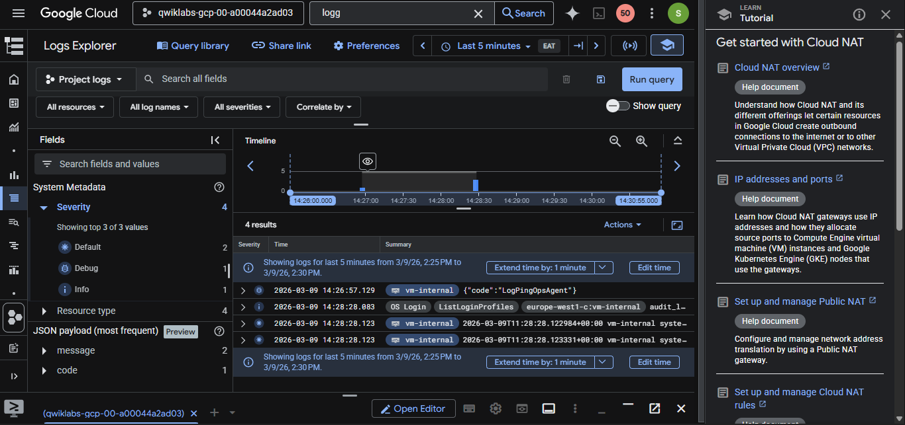

# GCP Private VM Access with IAP, Private Google Access and Cloud NAT

This project demonstrates how to securely run a **Google Compute Engine VM without a public IP address** and still allow it to access Google APIs and the internet usingud NAT

This project demonstrates how to 

The lab also demonstrates how to securely connect to the VM usingAT

This project demonstrates hoinstead of exposing SSH to the internet.

---

# Architecture Overview

The architecture includes:

- Customrely run a **Goog- GCP Private VM Access wiwithout external IP
-ss with IAP, Privatallowing SSH only through IAP
-P, Private Google Access anto reach Google APIs
-s with IAP, Private Goofor internet access
-ss with IAP, Private Gofor monitoring connections

Architecture Flow:

User → Cloud Shell → IAP Tunnel → Private VM
Private VM → Private Google Access → Google APIs
Private VM → Cloud NAT → Internet

---

# Lab Objectives

This lab covers the following tasks:

1. Create a custom VPC network
2. Configure firewall rules for IAP SSH access
3. Deploy a VM instance without a public IP
4. Connect to the VM using IAP tunnel
5. Enable Private Google Access
6. Access Google Cloud Storage from the VM
7. Configure Cloud NAT for internet access
8. Enable and view NAT logging

---

# Step 1: Create VPC Network

A custom VPC network was created with the following configuration:

- Network Name:eway** for int- Subnet Name:VM Access with IA- CIDR Range: VM Access with I
This network isolates internal resources and prevents direct internet exposure.

Screenshot:

---

# Step 2: Configure Firewall Rule

A firewall rule was created to allow SSH accesshe internet using **Private Google A

Configuration:

- Rule Name:AP, Private Google Acces- Source Range:M Access with IAP, - Protocol:te VM A- Port:rivate
This ensures that SSH access is allowede Google Access and Cland not from the public internet.

Screenshot:

---

# Step 3: Create Private VM Instance

A Compute Engine VM was deployed with the following configuration:

- Name:e APIs and the - Machine Type:M Access with IAP- OS: Debian 12
- Network:th IAP, Privat- External IP:VM Access 
This ensures the VM is with IAP, Private Googland cannot be accessed directly from the internet.

Screenshot:

---

# Step 4: Connect to VM using IAP

The VM was accessed securely using still allow it to access Googlewith the following command:

gcloud compute ssh vm-internal –zone ZONE –tunnel-through-iap

IAP allows secure SSH access*Google Compute Engine VM without a public IP

---

# Step 5: Enable Private Google Access

Private Google Access was enabled on the subnet to allow private instances to reachmpute Engine VM without a publwithout requiring a public IP address.

Screenshot:

---

# Step 6: Access Cloud Storage from Private VM

A Cloud Storage bucket was created and tested by copying an image file.

Example command:

gcloud storage cp gs://cloud-training/gcpnet/private/access.svg gs://BUCKET_NAME

Before enabling Private Google Access, the VMad of exposing SSH to the interne

After enabling it, the VM successfully accessed Cloud Storage.

---

# Step 7: Configure Cloud NAT

A Cloud NAT Gateway was created to allow the private VM to access the public internet for tasks like:

- Package updates
- External repositories
- Software downloads

Configuration:

- NAT Gateway:nstrates how t- Cloud Router:M Access with - Network:ate VM Access 
Screenshot:

---

# Step 8: Enable Cloud NAT Logging

Cloud NAT logging was enabled to monitor network connections and translation events.

Logs can be viewed inaccess Google APIs and the internet

Screenshot:

---

# Key Concepts Demonstrated

This lab demonstrates important Google Cloud networking concepts:

- Private VM architecture
- Identity-Aware Proxy (IAP)
- Private Google Access
- Cloud NAT
- Secure network design
- Logging and monitoring

---

# Security Benefits

This architecture improves security by:

- Removing public IP addresses
- Using IAP for secure access
- Allowing controlled internet access via NAT
- Monitoring outbound connections

---

# Technologies Used

- Google Cloud Platform
- Compute Engine
- VPC Networking
- Cloud NAT
- Identity-Aware Proxy
- Cloud Storage
- Cloud Logging
- gcloud CLI

---

# Conclusion

This lab demonstrates aLogging** for monitoring connections

Awhere compute instances remain private while still accessing necessary services using controlled mechanisms like **Private Google Access ana Cloud NAT**.
